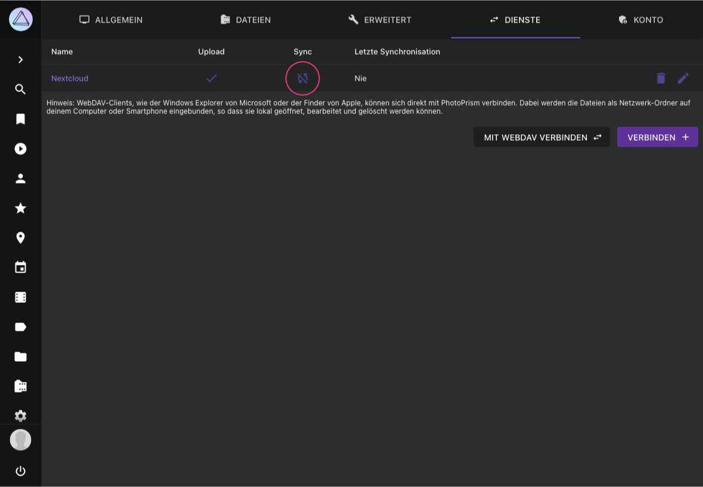
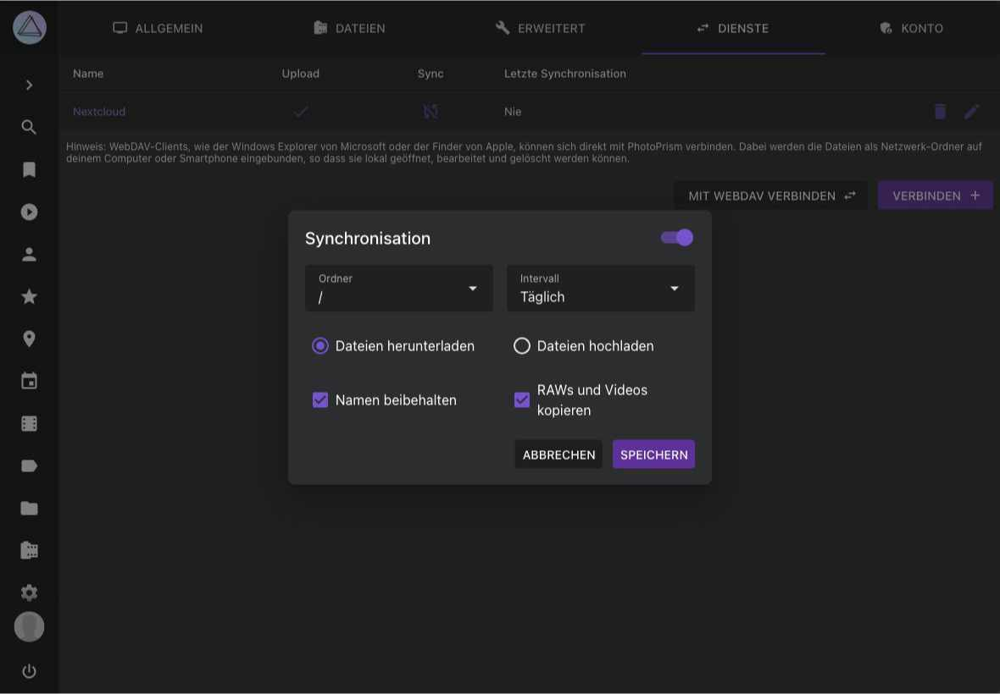

# Dateien mit anderen Apps synchronisieren #

In den [Einstellungen > Dienste](../settings/sync.md) kannst du deine PhotoPrism-Instanz mit anderen Diensten mit WebDAV-Unterstützung verbinden, zum Beispiel mit anderen PhotoPrism-Instanzen, Nextcloud oder ownCloud.

!!! attention ""
      Bei der Synchronisierung werden deine Dateien zu/von einem anderen Dienst hoch- oder heruntergeladen, was zusätzlichen Speicherplatz erfordert.

    Wenn PhotoPrism Dateien aus einer anderen lokalen Anwendung, z. B. Nextcloud, indexieren soll, empfehlen wir, deren Speicherordner [als originals Ordner einzubinden](https://docs.photoprism.app/getting-started/docker-compose/#photoprismoriginals), anstatt die Dateien über WebDAV zu synchronisieren. Dadurch wird verhindert, dass unnötige Kopien deiner Dateien erstellt werden.

## Dateien von/zu einerApp herunterladen/hochladen##
1. Gehe zu *Einstellungen*
2. Öffne das *Dienste* Tab
3. Klicke in den Sync Bereich deines Servers
   { class="shadow" }
4. Aktiviere die Synchronisation in der Ecke oben rechts
5. Wähle den Ordner, in welchem sich deine Bilder befinden
6. Entscheide wie oft die Dateien synchronisiert werden sollen
7. Selektiere alle Optionen, die zu deinem Anwendungsfall passen und klicke *Speichern*

{ class="shadow" }

### Synchronisations-Optionen ###
* *Dateien herunterladen*  - alle Dateien, die noch nicht in PhotoPrism existieren, werden regelmäßig von deinem Dienst heruntergeladen
* *Dateien hochladen* - alle Dateien (auch als privat markierte oder archivierte), die auf deinem Dienst noch nicht existieren, werden regelmäßig hochgeladen
* *Namen beibehalten* - Dateinamen werden beibehalten
* *RAWs und Videos kopieren* - Neben JPEGs werden auch RAW Dateien und Videos synchronisiert

### Fehlersuche bei langsamen oder Depth-limitierten Servern ###

PhotoPrism bevorzugt `PROPFIND Depth: infinity`, um Verzeichnisse rekursiv zu durchsuchen, und wechselt automatisch zu einer iterativen `Depth: 1`-Traversierung, wenn ein WebDAV-Server die rekursive Variante ablehnt (zum Beispiel pCloud und ähnliche Anbieter). Wird auf `Depth: 1` zurückgegriffen, protokolliert die Anwendung die Anzahl der Folgeanfragen und die dafür benötigte Zeit. Du kannst die Logs also nach `depth-1 fallback` oder `PROPFIND` durchsuchen, um bei einer langsamen Synchronisation nachzuvollziehen, was der Client getan hat. Versteckte Dateien, die mit einem Punkt beginnen, sowie Einträge in versteckten Punkt-Verzeichnissen werden dabei ausgelassen, da es sich häufig um Sperrdateien, unvollständige Uploads oder Metadaten des Anbieters handelt.

Für große Dateiübertragungen gilt kein Gesamt-Timeout. PhotoPrism verwendet jedoch separate Timeouts für den Verbindungsaufbau, den TLS-Handshake, inaktive Verbindungen und Expect-Continue, um sich schnell von blockierten oder nicht reagierenden Servern zu erholen, ohne eine laufende Übertragung zu unterbrechen.
