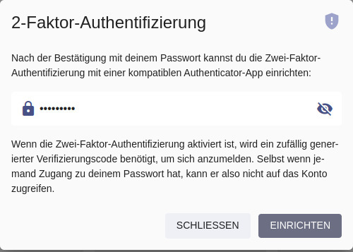
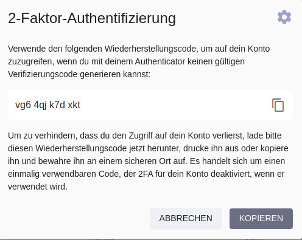

# 2-Faktor Authentifizierung

Zwei-Faktor  Authentifizierung (2FA) kann eine zusätzliche Sicherheitsebene für [dein Konto](../settings/account.md) schaffen, für den Fall, dass sich jemand Zugang zu deinem Passwort verschafft. Wenn sie aktiviert ist, brauchst du zusätzlich zu deinem Passwort einen zufällig generierten Verifizierungscode, um dich einzuloggen:

{ class="shadow" }

### Authentifizierungs-Apps

Um 2FA für dein Konto zu aktivieren, brauchst du eine kompatible Authentifizierungs-App oder Gerät, zum Beispiel:

- [Google Authenticator](https://apps.apple.com/us/app/google-authenticator/id388497605)
- [Microsoft Authenticator](https://apps.apple.com/us/app/microsoft-authenticator/id983156458)
- [2FA Authenticator (2FAS)](https://apps.apple.com/us/app/2fa-authenticator-2fas/id1217793794)

Am besten installierst du die Authentifizierungs-App auf deinem Handy, so kannst du 2FA ganz einfach einrichten, indem du den angezeigten QR-Code mit deiner Kamera scannst.

!!! info "Hardware Geräte"
    Es gibt zwar auch spezielle Hardware-Geräte als Alternative zu Authentifizierungs-Apps, aber diese sind weniger verbreitet und wir können keine Empfehlungen dazu geben.

## Einrichtung

### Schritt 1: Verifizierungscode

Du kannst 2FA für dein Konto aktivieren, indem du zu [*Einstellungen > Konto*](../settings/account.md) navigierst und dann auf die Schaltfläche *2-Faktor Authentifizierung* klickst, um den Einrichtungsdialog zu öffnen:

{ class="shadow" }

Scanne auf der folgenden Seite den angezeigten QR-Code mit deiner Authentifizierungs-App (oder verwende den angezeigten Einrichtungsschlüssel, wenn du eine App oder ein Gerät ohne Kamera verwendest) und gib dann den generierten Verifizierungscode ein, um fortzufahren.

### Schritt 2: Wiederherstellungscode

Im letzten Schritt vor der Aktivierung von 2FA wird dir ein Wiederherstellungscode angezeigt, den du verwenden kannst, um auf dein Konto zuzugreifen, wenn du mit deiner App oder deinem Gerät keinen gültigen Verifizierungscode erzeugen kannst:

{ class="shadow" }

!!! danger ""
    Um zu verhindern, dass du aus deinem Konto ausgesperrt wirst, lade bitte diesen Wiederherstellungscode herunter, drucke ihn aus oder **kopiere ihn** und bewahre ihn an einem sicheren Ort auf. Es handelt sich um einen einmalig verwendbaren Code, der **2FA für dein Konto deaktivieren wird**, wenn du ihn verwendest.

### Schritt 3: App Passwörter

Wenn 2FA für dein Konto aktiviert ist, können andere Apps und Dienste dein Passwort nicht mehr verwenden, da sie keinen Zugriff auf die Verifizierungscodes haben.

Du kannst daher app-spezifische Passwörter für sie erstellen, indem du zu [*Einstellungen > Konto*](../settings/account.md) navigierst und dann auf die Schaltfläche *Apps und Geräte* klickst. Wir empfehlen, app-spezifische Passwörter auch dann zu verwenden, wenn 2FA für dein Konto nicht aktiviert ist.

Beispiel für die Erstellung eines App-Passworts, das du mit [WebDAV-kompatiblen](../sync/webdav.md) Dateisynchronisierungs-Apps wie [PhotoSync](../sync/sync-phone.md) verwenden kannst:

{ class="shadow" }

!!! tldr ""
    Wenn du die [Berechtigung](https://docs.photoprism.app/developer-guide/api/auth/#authorization-scopes) *WebDAV* auswählst, stellst du sicher, dass das App-Passwort nicht für die Anmeldung über die reguläre Benutzeroberfläche oder für andere Aktionen verwendet werden kann. Apps können auch nicht dein Passwort ändern oder Benutzerkonten verwalten, selbst wenn du ihnen *Vollen Zugriff* gewährst.

## Neue Authentifizierungs-App

Um zu einer neuen Authentifizierungs-App oder einem neuen Gerät zu wechseln, musst du zuerst [2FA deaktivieren](#2fa-deaktivieren) und dann erneut [einrichten](#einrichtung).

## 2FA deaktivieren

Wenn 2FA für dein Konto aktiviert wurde, kannst du es deaktivieren, indem du zu [*Einstellungen > Konto*](../settings/account.md) navigierst, auf die Schaltfläche *2-Faktor-Authentifizierung* klickst und dann dein Passwort zur Bestätigung eingibst:

{ class="shadow" }

!!! tldr ""
    Wenn du den Zugriff auf deine Authentifizierungs-App oder dein Gerät verlierst, kannst du deinen [Wiederherstellungscode](#schritt-2-wiederherstellungscode) verwenden, um wieder Zugriff auf dein Konto zu erhalten. Es handelt sich um einen einmal verwendbaren Code, der 2FA für dein Konto deaktiviert, wenn du ihn verwendest.

     Wenn du dich nicht mehr an deinen Wiederherstellungscode erinnerst, kannst du auch [einen Admin](roles.md#admin) bitten, 2FA für dich im *Benutzerdetails*-Dialog des [Admin Web UI](index.md#benutzer-details-bearbeiten) oder durch Ausführen des [folgenden Befehls](cli.md#optionen) in einem [Terminal](https://docs.photoprism.app/getting-started/docker-compose/#command-line-interface) zu deaktivieren:    
    ```bash
    photoprism users mod --disable-2fa [username]
    ```
